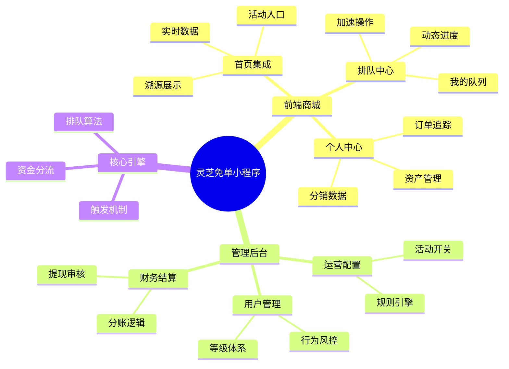
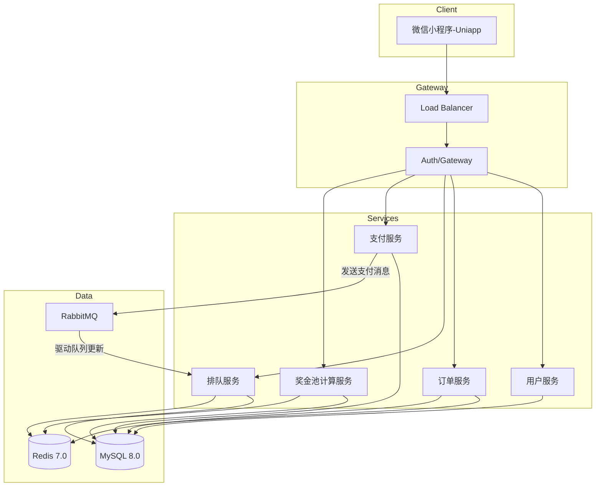
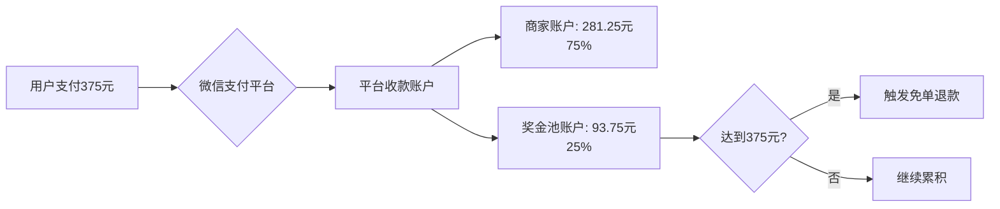
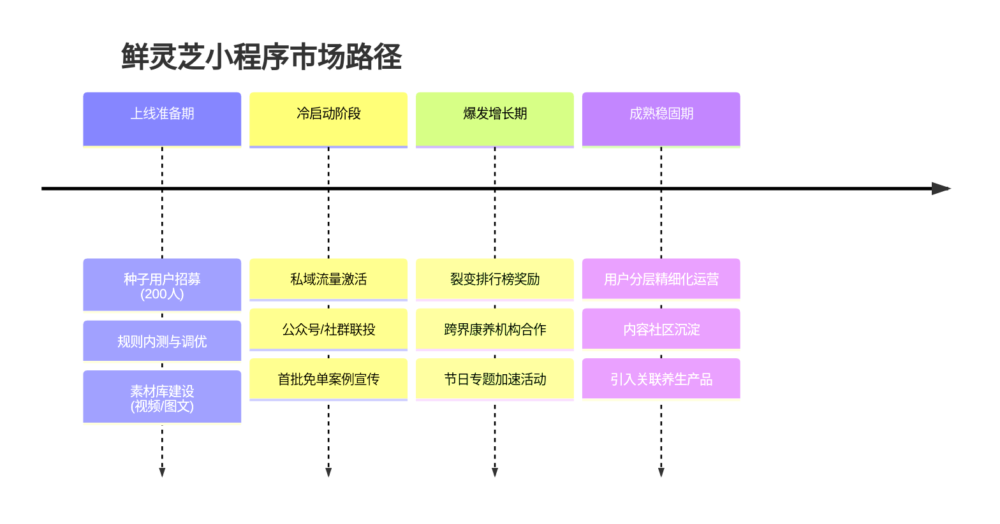
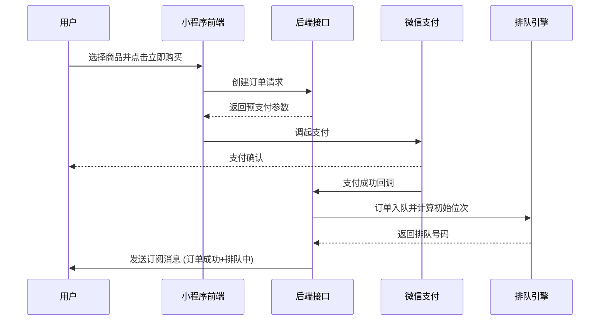
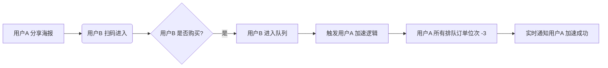
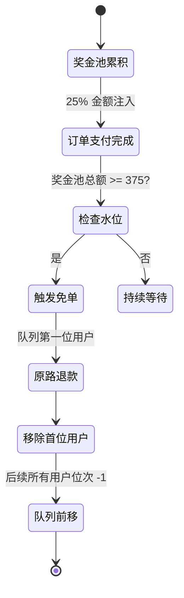

# 产品需求文档 (PRD) - 鲜灵芝“排队免单”微信小程序

---

## 🚀 1. 项目概述

### 1.1 项目背景

针对鲜灵芝核心产品（零售价 **375元**）设计一套创新的社交营销系统。通过“排队免单”机制结合社交裂变，旨在实现低成本获客、高频复购及品牌口碑的快速传播。

### 1.2 核心价值主张

> [!IMPORTANT]
> **核心逻辑**：每 4 单销售额产生的利润（按 25% 提取）即可支撑 1 单免单，实现“消费即投资，排队得免费”的营销闭环。

| 维度 | 核心价值内容 |
| :--- | :--- |
| **用户价值** | 获得免费获取产品的机会，享受游戏化的购物与回馈体验 |
| **商家价值** | 极速拉升单品销量，锁定用户复购，构建私域流量池 |
| **社交价值** | 建立基于信任的邀请关系，降低信任成本，实现裂变式传播 |

### 1.3 核心指标 (KPI)

* 🎯 **转化率**：浏览至购买的转换率提升目标 20%
* 🌱 **裂变系数**:平均每位用户邀请人数 (K-Factor) >= 1.5
* 🔄 **复购率**：月度复购用户占比
* 💰 **GMV**：月均交易总额增长率

---

## 🎯 1.4 核心业务逻辑设计

### 1.4.1 免单规则详解

| 模块 | 具体设计 | 说明 |
| :--- | :--- | :--- |
| **消费入队** | 用户成功支付375元订单后，自动获得排队号码并进入免单队列 | 每笔订单对应一个独立的排队资格 |
| **奖金池注入** | 每笔订单金额的25%（93.75元）自动注入奖金池 | 这是商家让利部分，也是免单的资金来源 |
| **免单触发条件** | 当奖金池累计金额 ≥ 375元时，系统自动为队列首位用户办理全额免单 | 理论上每4位新用户消费可促成1位免单 |
| **免单执行** | 系统向免单用户原支付渠道退款375元，并发送免单成功通知 | 免单后该用户排队号作废，队列自动前移 |

> [!NOTE]
> **免单计算公式**：免单触发间隔 = 商品单价 ÷ (商品单价 × 奖金池比例) = 375 ÷ 93.75 = 4 单

### 1.4.2 加速机制设计

#### 邀请加速

* **触发条件**：用户分享专属邀请链接，好友通过该链接完成首次购买
* **加速效果**：邀请人名下**所有在排队的订单**位次统一提前 **3位**
* **限制规则**：
  * 每位被邀请人仅能为一位邀请人提供加速（防止多人刷同一好友）
  * 被邀请人必须是新用户或通过该链接首次购买
  * 加速不能使位次超越当前第1位（避免负数位次）

#### 复购加速

* **触发条件**：用户再次购买鲜灵芝产品
* **加速效果**：新订单获得独立排队号，同时为该用户名下**所有在排队的历史订单**各提前 **2位**
* **业务价值**：激励用户持续复购，提升客户终身价值(LTV)

#### 限时加速活动（运营可配置）

* 节日/周末特惠：分享加速翻倍（提前6位）
* 新用户福利：首单自动获得3张加速券，每张可提前1位

### 1.4.3 用户体验核心要素

> [!IMPORTANT]
> **进度透明化**是建立用户信任的关键！所有排队数据必须实时、准确、可追溯。

#### 进度可视化

* **实时排队位次**：精确显示"您当前排第XX位，前方还有XX人"
* **奖金池水位**：动态展示"奖金池已累积XXX元，距离您免单还需XXX元"
* **预计免单时间**：基于历史数据预测"按当前速度，预计XX天后免单"
* **已节省金额**：展示"通过加速已为您节省XXX元等待成本"

#### 智能消息提醒

通过**微信模板消息**或**订阅消息**推送关键状态变化：

* 📦 **支付成功**：订单确认 + 排队号生成
* 🚀 **位次变化**：好友助力成功 / 前方用户免单导致位次前移
* 🎉 **免单成功**：全额退款到账通知 + 晒单引导
* ⏰ **即将免单**：当进入前10位时发送提醒，激发期待感
* 📮 **物流更新**：商品发货、签收状态同步

---

## 👥 2. 用户角色与画像

### 2.1 用户类型定义

| 用户类型 | 核心特征 | 核心需求 | 行为偏好 |
| :--- | :--- | :--- | :--- |
| **新用户** | 首次进入，对模式持怀疑/好奇态度 | 规则透明化、低门槛尝试 | 偏向查看历史免单记录和详细规则 |
| **活跃用户** | 已购买，正处于排队激励期 | 尽早免单、加速进度 | 频繁查看位次变化，愿意参与分享加速 |
| **团长/KOL** | 有一定社群基础或影响力 | 推广收益、长期激励、信任背书 | 关注邀请统计及多级加速权重的叠加 |
| **运营人员** | 内部管理人员 | 数据监控、状态调整、客服支持 | 追求操作日志完备，风控预警及时 |

## 🛠️ 3. 功能需求详述

### 3.1 功能架构全景



### 3.2 关键功能模块分解

#### 3.2.1 核心移动端功能 (Mobile)

* **A. 智能首页/产品详情**
  * [x] **产地溯源**：支持视频/高清图展示灵芝产地。
  * [x] **动态公示**：实时滚动“今日已免单用户”及“奖金池当前水位”。
  * [x] **交互引导**：折叠式排队规则说明，降低新用户理解成本。
* **B. 沉浸式排队中心**
  * [x] **可视进度**：每笔订单独立的进度条，显示距免单所需的奖金差额。
  * [x] **一键加速**：集成分享海报生成、加速券使用记录。
* **C. 社交分享模块**
  * [x] **裂变海报**：动态生成带用户头像和专属加密二维码的精美分享图。

#### 3.2.2 管理后台功能详解 (Admin Dashboard)

后台管理系统是运营的“大脑”，需具备强大的数据可视与配置能力。

##### A. 📊 核心数据看板 (Dashboard)

* **实时概览**：总参与人数、今日新增排队数、今日免单数、当前奖金池总额。
* **转化漏斗**：访问 -> 购买 -> 分享 -> 裂变 的全链路转化率监控。
* **裂变图谱**：可视化展示用户邀请关系网，识别关键KOL节点。

##### B. ⚙️ 活动灵活配置中心

* **奖金池参数**：支持动态调整奖金提取比例（如标准25%，活动期30%），调整后立即生效于新订单。
* **加速规则引擎**：
  * 配置邀请加速的步数（如：邀请1人提前3位）。
  * 配置复购加速的权重（如：老用户复购全队提前2位）。
  * 设置活动有效期及特殊倍率（如：周末加速卡翻倍）。

##### C. 👥 用户与订单深度管理

* **全景用户画像**：查看用户基础信息、累计消费、排队历史、邀请下线列表及获得的免单总额。
* **排队干预**：处理异常订单（如退款导致的位次移除），支持查看每一笔订单的排队日志。
* **售后处理**：标准化的退款/售后流程，退款时自动触发排队位次重算机制。

##### D. 🛍️ 商品与库存管理

* **多规格管理**：支持鲜灵芝不同克重（375g/500g）的独立SKU管理，可设置不同的排队奖金池门槛。
* **多商户扩展**：预留多商户接口，未来支持其他优质农产品商家入驻，独立管理库存与发货。

---

## ⚙️ 4. 非功能性需求

### 4.1 核心质量指标

| 维度 | 指标要求 | 说明 |
| :--- | :--- | :--- |
| **性能** | 页面 LCP < 1.5s | 保证在弱网环境下也能快速渲染排队状态 |
| **高并发** | 支撑 5000 QPS | 关键点在于微信支付回调与排队引擎的异步解耦 |
| **可靠性** | 数据 99.99% 一致 | 奖金池计算必须严格遵循事务，严禁负数或漏算 |
| **兼容性** | 微信基础库 >= 2.10.0 | 覆盖 95% 以上主流智能手机用户 |

### 4.2 安全与风控预案

> [!CAUTION]
> **支付安全**：所有提现审核必须经过人工+系统双重校验，且每日设有提现总额阈值报警。

* **加密通信**：所有业务接口必须通过 HTTPS 传输，核心链路增加签名校验。
* **反爬虫**：限制核心接口（如免单名单）的访问频率，防止恶意采集数据。

## 5. 技术架构建议

### 5.1 整体技术架构

#### 前端架构

* **开发框架**：Uni-app (Vue 3 + Vite) - 支持编译为微信小程序，具备良好的开发体验和多端扩展能力。
* **组件库**：uView Plus / Uni-ui - 适配移动端的高清 UI 组件库。
* **状态管理**：Pinia - 轻量级、现代化的状态管理。

#### 后端架构

* **核心框架**：Spring Boot 3.2.x - 提供高效、规范的微服务开发体验。
* **核心语言**：Java 21 - 利用虚拟线程（Virtual Threads）优化高并发支付/回调处理。
* **安全框架**：Spring Security + JWT - 保证 API 访问安全。
* **任务调度**：Spring Task / XXL-Job - 用于定期检查奖金池并触发免单。

#### 存储与中间件

* **数据库**：MySQL 8.0 - 存储用户信息、订单、排队队列等核心数据，确保 ACID 事务特性。
* **高性能缓存**：Redis 7.x - 存储实时排队位次、奖金池水位、分布式锁（防止重复处理回调）。
* **消息队列**：RabbitMQ / Redis Stream - 异步处理支付完成后的排队逻辑，削峰填谷。
* **对象存储**：腾讯云 COS / 阿里云 OSS - 存储商品高清图、用户海报素材。

### 5.2 系统逻辑架构图



### 5.2 数据库设计核心表

用户表（user）：用户基本信息、邀请关系
订单表（order）：订单详情、支付状态
排队队列表（queue）：排队顺序、位次、加速记录
奖金池表（bonus_pool）：资金流水、余额
邀请关系表（invitation）：邀请人-被邀请人关系
系统配置表（config）：活动规则参数

### 5.3 关键接口设计

#### 5.3.1 创建订单接口

**接口路径**：`POST /api/order/create`

**输入参数**：

```json
{
  "productId": "string",
  "userId": "string", 
  "quantity": 1,
  "addressId": "string",
  "inviteCode": "string"  // 可选，邀请人专属码
}
```

**输出**：

```json
{
  "orderId": "string",
  "prepayParams": {
    "timeStamp": "string",
    "nonceStr": "string",
    "package": "string",
    "signType": "MD5",
    "paySign": "string"
  }
}
```

#### 5.3.2 支付回调与分账接口

**核心职责**：处理微信支付异步回调，执行资金分配和排队逻辑

**资金分流机制**：



**接口逻辑**：

1. **验证签名**：校验微信回调参数的合法性
2. **幂等处理**：通过 Redis 分布式锁防止重复处理（key: `payment:callback:{orderId}`）
3. **事务性分账**：

   ```sql
   -- 原子性操作，确保资金一致性
   BEGIN TRANSACTION;
   UPDATE order SET status='PAID', paid_at=NOW() WHERE order_id=?;
   INSERT INTO bonus_pool (order_id, amount) VALUES (?, 93.75);
   INSERT INTO queue (order_id, user_id, position) VALUES (?, ?, ?);
   COMMIT;
   ```

4. **触发排队**：调用排队服务生成排队号
5. **发送消息**：异步通知用户支付成功及排队信息

> [!CAUTION]
> **资金安全核心**：所有涉及奖金池的操作必须使用数据库事务，严禁出现资金负数或漏算情况。建议每日定时对账，确保 `奖金池总额 = 所有已支付订单 × 25% - 已免单金额`。

#### 5.3.3 获取排队信息接口

**接口路径**：`GET /api/queue/myStatus`

**输入**：Header 中携带 JWT Token（从中提取 userId）

**输出**：

```json
{
  "queues": [
    {
      "orderId": "xxx",
      "productName": "鲜灵芝375g",
      "currentPosition": 12,
      "totalAhead": 11,
      "bonusPoolCurrent": 280.5,
      "bonusPoolNeeded": 94.5,
      "estimatedDays": 3,
      "savedAmount": 45.0,  // 通过加速节省的等待成本
      "accelerateRecords": [
        {
          "type": "INVITE",
          "count": 2,
          "createdAt": "2026-01-20T10:30:00Z"
        }
      ]
    }
  ],
  "globalStats": {
    "totalFreeUsers": 156,
    "todayFreeCount": 8
  }
}
```

**缓存策略**：排队位次数据存储于 Redis Sorted Set，key: `queue:active`，score 为排队序号，value 为 `orderId`

#### 5.3.4 触发免单检查接口（定时任务）

**执行频率**：每次支付回调后触发一次检查，或定时任务每 **5分钟** 兜底检查一次

**核心逻辑**：

```java
@Scheduled(cron = "0 */5 * * * ?")
public void checkAndTriggerFree() {
    // 1. 获取奖金池总额
    BigDecimal bonusPool = bonusPoolService.getTotalAmount();
    
    // 2. 获取队列第一位订单
    QueueDO firstQueue = queueService.getFirstInLine();
    
    if (firstQueue != null && bonusPool.compareTo(new BigDecimal("375")) >= 0) {
        // 3. 执行免单（原路退款）
        refundService.refundToOrigin(firstQueue.getOrderId(), new BigDecimal("375"));
        
        // 4. 扣减奖金池
        bonusPoolService.deduct(new BigDecimal("375"));
        
        // 5. 移除队列首位，所有人位次前移
        queueService.removeFree(firstQueue.getQueueId());
        
        // 6. 发送免单成功通知
        notificationService.sendFreeSuccessMessage(firstQueue.getUserId());
    }
}
```

#### 5.3.5 微信消息推送接口

**技术选型**：使用微信**订阅消息**（需用户主动订阅）或**模板消息**（服务号）

**关键场景与模板**：

| 场景 | 触发时机 | 模板内容 |
| :--- | :--- | :--- |
| 支付成功 | 支付回调完成 | 订单号、金额、排队号、当前位次 |
| 位次变化 | 好友助力/前方免单 | 当前位次、变化数量、预计免单时间 |
| 免单成功 | 退款执行完成 | 免单金额、退款方式、晒单引导 |
| 即将免单 | 进入前10位 | 当前位次、预计免单时间、加速提示 |

**接口实现示例**：

```java
public void sendPositionChangeMessage(String userId, int oldPos, int newPos) {
    WxMaSubscribeMessage message = WxMaSubscribeMessage.builder()
        .toUser(userId)
        .templateId("TEMPLATE_ID_XXX")
        .page("pages/queue/index")
        .data(Arrays.asList(
            new WxMaSubscribeMessage.Data("thing1", "排队位次变化"),
            new WxMaSubscribeMessage.Data("number2", String.valueOf(newPos)),
            new WxMaSubscribeMessage.Data("thing3", "恭喜您，向免单又近一步！")
        ))
        .build();
    
    wxMaService.getMsgService().sendSubscribeMsg(message);
}
```

---

## 📈 6. 运营与推广方案

### 6.1 分阶段营销推广策略

#### 第一阶段：冷启动期 (种子用户积累)

* **私域引爆**：利用现有的老客户微信群、公众号粉丝进行首发，提供"创始人福利"（如：首批参与者直接获得5个加速位）。
* **信任建立**：高频晒出真实的产地视频、发货视频，以及前几位免单用户的真实反馈/转账记录截图，建立初始信任。
* **目标**：快速积累前200个排队订单，让队列"跑起来"。

#### 第二阶段：裂变增长期 (病毒式传播)

* **团长分销计划**：
  * 招募养生馆店主、社区团购团长作为KOL。
  * 提供双重激励：除了高额佣金，团长销售的订单可以为其个人排队订单提供双倍加速效果。
* **福利任务体系**：
  * 上线"每日签到"、"浏览科普文章"、"生成日签海报"等轻量任务，奖励"微加速"（如前移0.1位或积分兑换加速卡），维持日活。
* **拼团加速**：推出"3人成团"购买，全团排队位次额外提前5位，利用社交压力促进成单。

#### 第三阶段：持续运营期 (留存与复购)

* **用户分层运营**：
  * **VIP通道**：针对累计消费满3000元的高价值用户，提供专属"VIP超车道"（奖金池独立或权重更高）。
  * **沉睡唤醒**：对排队超过30天未免单且无新互动的用户，推送"回归礼包"（大额加速券），激活关注。
* **内容营销**：
  * 在小程序内开设"灵芝养生局"专栏，发布食谱、功效科普。
  * 鼓励用户发布"食用打卡"，打卡满7天赠送一次加速机会。

### 6.2 推广路线图 Timeline



---

## 🛡️ 7. 风险控制与合规

### 7.1 合规性声明

> [!WARNING]
> **合规要点**：本活动本质为“实物促销回馈”，严禁在宣传中使用“理财”、“高收益”、“返利”等金融类敏感词汇。

* **资金存管**：免单专用奖金池需由第三方监管或单独账户公示，确保款项专款专用。
* **隐私保护**：严格遵守《个人信息保护法》，仅采集发货与支付必须的最小化数据。

### 7.2 风险应对矩阵

| 风险类型 | 表现形式 | 核心应对措施 | 优先级 |
| :--- | :--- | :--- | :--- |
| **资金风险** | 奖金池水位异常波动 | 建立 10% 风险储备金；动态调整规则开关 | 🔴 高 |
| **技术风险** | 秒杀/回调高并发崩溃 | 实施多级缓存及消息队列削峰；全压力测试 | 🔴 高 |
| **作弊风险** | 批量小号恶意刷单 | 引入微信实名校验；AI 行为识别引擎异常封禁 | 🟡 中 |
| **舆论风险** | 用户误解规则产生负评 | 24h 客服在线响应；规则 100% 透明公示 | 🟡 中 |

### 7.3 退出与清算机制

1. **告知义务**：活动终止需通过官方渠道提前 **30天** 公示。
2. **清算方案**：若活动意外终止，剩余奖金池资金按排队比例折算为等值购物抵用券，或按比例退还最后一批排队用户。

## 8. UI/UX 核心流程 (User Flow)

### 8.1 核心购买与排队流程



### 8.2 社交裂变加速逻辑



### 8.3 奖金池与免单触发链路



## 9. 界面设计原型参考 (Low-Fi)

1. **首页**：顶部采用灵芝实地背景图，中心区域浮动显示“今日已免单次数”，底部醒目橙色按钮“立即参与免单”。
2. **排队页**：采用进度条形式展示奖金池水位，卡片式展示我的排队位次，左右滑动切换不同订单。
3. **加速弹窗**：当用户分享成功时，弹出动态加速效果（如位次小火箭上升），增强获得感。
